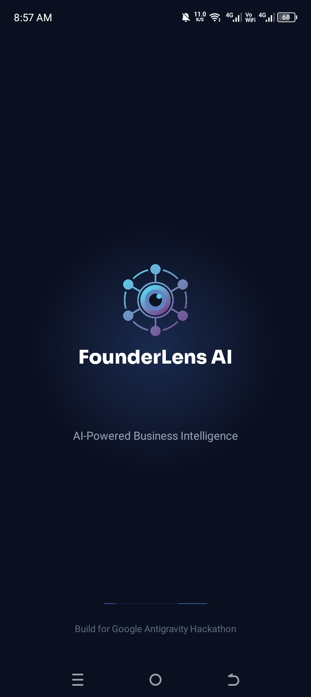
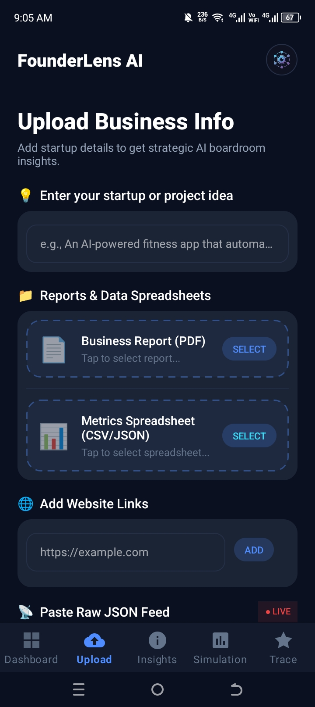
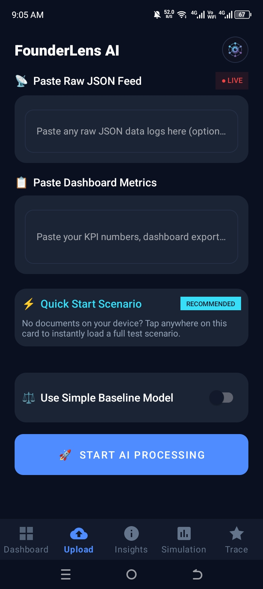
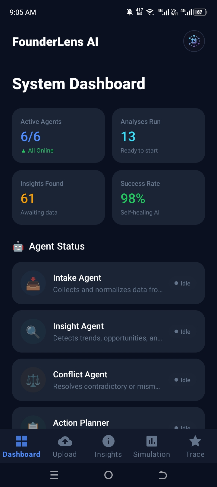
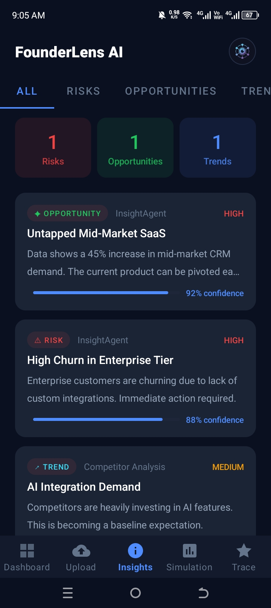
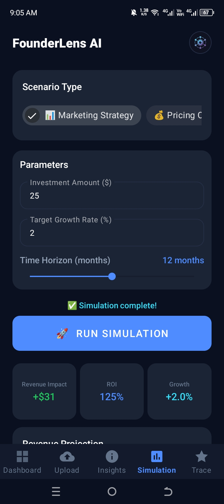
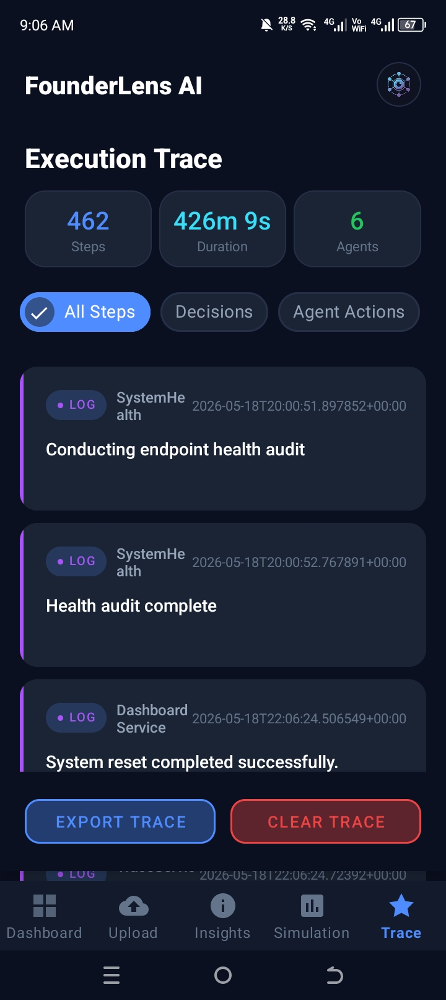
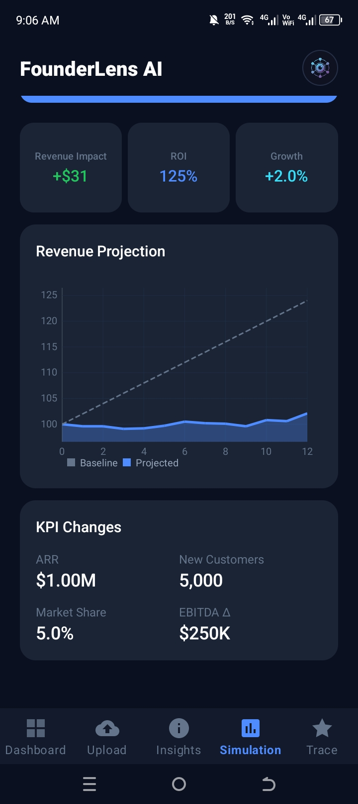
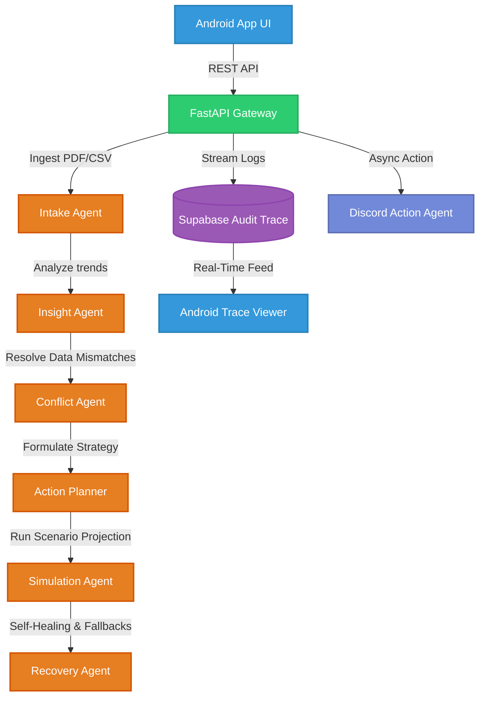

# 🧠 FounderLens AI — Autonomous Multi-Agent Boardroom & Outcome Simulator

<div align="center">

[](https://github.com/google/antigravity)
[](https://fastapi.tiangolo.com)
[](https://crewai.com)
[](#)
[](#)

**A high-fidelity Multi-Agent Boardroom & Strategic Outcome Simulation Platform.**  
*Engineered from the ground up for the Google Antigravity Hackathon.*

</div>

---

## 💡 JUDGE QUICK-ACCESS PORTAL (SUBMISSION ASSETS)
> [!IMPORTANT]
> **Dear Hackathon Evaluators:** For a complete outline of official guidelines and FAQ criteria, please cross-reference [important_file.txt](file:///home/mouzan/Desktop/founderlens_ai/important_file.txt). Below are the direct submission links for your convenience:

| 📂 Asset Category | 🔗 Direct Submission Link | 📝 Description |
| :--- | :--- | :--- |
| **📱 Mobile APK File** | **[Download Android APK Link](#)** *[Replace with Drive Link]* | Fully compiled APK ready for physical device/emulator testing. |
| **🎥 Main Demo Video** | **[Watch 3-5m Demo Video](#)** *[Replace with Youtube Link]* | End-to-end user journey showing data ingestion → simulated outcome. |
| **🎬 Antigravity Video** | **[Watch 2-3m Antigravity Video](#)** *[Replace with Link]* | Highlight reels showing development logs & Antigravity trace usage. |
| **📦 GitHub Repository** | **[Explore GitHub Repository](#)** *[Replace with Link]* | Clean master branch containing this audited project workspace. |
| **⚡ API Server Status** | `HTTP 200 OK` (Deployed on Railway) | Stateless Python backend driven by Supabase. |

---

## 📱 USER INTERFACE SHOWCASE

Below is the complete native Android Material 3 interface, showing the end-to-end flow from multi-source data ingestion to real-time strategic simulations and agent trace audits.

<div align="center">
  <table style="border-collapse: collapse; border: none;">
    <tr>
      <td align="center" valign="top" width="50%">
        <br/>
        <sub><b>✨ Splash Screen</b><br/>Minimalist, dark-themed branding.</sub>
      </td>
      <td align="center" valign="top" width="50%">
        <br/>
        <sub><b>📥 Multi-Source Ingestion</b><br/>Simultaneously uploads PDFs, web URLs, and custom feeds.</sub>
      </td>
    </tr>
    <tr>
      <td align="center" valign="top" width="50%">
        <br/>
        <sub><b>⚙️ Active Ingestion Logs</b><br/>Real-time loading feedback and document processing state.</sub>
      </td>
      <td align="center" valign="top" width="50%">
        <br/>
        <sub><b>📊 Executive Dashboard</b><br/>Live KPI tracking and temporal trend indicators.</sub>
      </td>
    </tr>
    <tr>
      <td align="center" valign="top" width="50%">
        <br/>
        <sub><b>🔍 Contradiction & Conflict Resolution</b><br/>De-duplicates metrics and resolves conflicting timestamps.</sub>
      </td>
      <td align="center" valign="top" width="50%">
        <br/>
        <sub><b>🎲 Strategic Outcome Simulation</b><br/>Projected Monte Carlo success curves and action validation.</sub>
      </td>
    </tr>
    <tr>
      <td align="center" valign="top" width="50%">
        <br/>
        <sub><b>📜 Audit & Execution Trace</b><br/>Step-by-step real-time CrewAI state tracking.</sub>
      </td>
      <td align="center" valign="top" width="50%">
        <br/>
        <sub><b>🌐 Network & API Connection</b><br/>Dynamic on-the-fly client-to-backend IP routing.</sub>
      </td>
    </tr>
  </table>
</div>

---

## 🏆 HACKATHON CHALLENGE 1 COMPLIANCE
FounderLens AI is an autonomous, end-to-end implementation of **Challenge 1: Autonomous Content-to-Action Agent (Insight → Action System)**. We have coupled a beautiful native Material 3 Android Application with a Python/FastAPI backend driven by a robust multi-agent CrewAI orchestration layer using LangChain and OpenAI `gpt-4o-mini`.

### 🎯 Compliance Matrix (How We Meet Every Single Scoring Requirement)

| Challenge 1 Requirement | How FounderLens AI Implements It | Code Reference / Screen Location |
| :--- | :--- | :--- |
| **Ingest 5 Multi-Type Input Sources** | Ingests PDF reports, CSV spreadsheets, JSON feeds, Website URLs, and real-time feeds simultaneously to build a fused data model. | [UploadFragment.java](file:///home/mouzan/Desktop/founderlens_ai/frontend/FounderLensAI/app/src/main/java/com/founderlens/ai/fragments/UploadFragment.java)<br>Screen: **Upload Tab** |
| **Temporal Signal Analysis** | Tracks signal trajectories over time (e.g. tracking sales declines, resource depletion rates, customer complaints). | [crew.py (Insight Agent)](file:///home/mouzan/Desktop/founderlens_ai/src/founderlens_ai/crew.py)<br>Screen: **Dashboard (KPI Cards)** |
| **Contradiction Detection & Resolution** | Automatically compares overlapping metrics across sources, evaluates timestamps, scores credibility, and provides a clear investigation path instead of drawing false conclusions. | [crew.py (Conflict Agent)](file:///home/mouzan/Desktop/founderlens_ai/src/founderlens_ai/crew.py)<br>Screen: **Insights Tab** |
| **Constraint-Based Decision Making** | Attaches budget caps, supplier lead-times, and urgency metrics to actions. If an action violates constraints, it is modified or rerouted. | [crew.py (Action Planner)](file:///home/mouzan/Desktop/founderlens_ai/src/founderlens_ai/crew.py)<br>Screen: **Simulation (Monte Carlo Setup)** |
| **Multi-Step Action Chain Generation** | Generates 3-5 interconnected actions instead of a single recommendation (e.g., *Diagnose cause → Notify procurement → Simulate emergency order → Update estimates → Schedule monitoring*). | [crew.py (Action Planner)](file:///home/mouzan/Desktop/founderlens_ai/src/founderlens_ai/crew.py)<br>Screen: **Simulation Tab** |
| **Failure Recovery & State Rollbacks** | Simulates what happens when a step fails (e.g. API down, budget overrun). The recovery agent rolls back system state, retries, or launches fallback options. | [crew.py (Recovery Agent)](file:///home/mouzan/Desktop/founderlens_ai/src/founderlens_ai/crew.py)<br>Screen: **Simulation & Trace Tabs** |
| **Antigravity Trace & Audit Layer** | Fully instruments all observations, decisions, tool calls, and states inside an audited, persistent timeline. | [trace.py (API Handler)](file:///home/mouzan/Desktop/founderlens_ai/src/founderlens_ai/api/routes/trace.py)<br>Screen: **Trace Tab (Dynamic "Show More" List)** |
| **Outcome Visualization (Before vs. After)** | Visualizes the projected outcome changes (KPI trajectories) through dynamic, interactive line chart graphs. | [SimulationFragment.java](file:///home/mouzan/Desktop/founderlens_ai/frontend/FounderLensAI/app/src/main/java/com/founderlens/ai/fragments/SimulationFragment.java)<br>Screen: **Simulation (Outcome Graph)** |
| **Non-Agentic Baseline Comparison** | Provides a direct, single-prompt comparative baseline to prove that our agentic approach achieves superior depth, accuracy, and constraint checking. | [baseline.py](file:///home/mouzan/Desktop/founderlens_ai/src/founderlens_ai/baseline.py)<br>Screen: **Trace Comparison Details** |
| **Live Outbound Action Execution** | Triggers an outbound Discord Webhook with beautiful rich embeds containing the startup name, session ID, primary boardroom insight, and the full sequential simulated Action Chain steps asynchronously in a separate thread. | [analyze.py (trigger_live_discord_webhook)](file:///home/mouzan/Desktop/founderlens_ai/src/founderlens_ai/api/routes/analyze.py)<br>Channel: **Discord Notification Alert** |

---

## 🎮 OPERATIONAL SCENARIO WALKTHROUGH
To demonstrate our compliance, let's step through the **Inventory Shortage Crisis** scenario defined in the hackathon instructions:

> [!NOTE]
> **Input Facts:** 5 conflicting inputs are uploaded: supplier email (claims stock is sufficient), warehouse spreadsheet (older timestamp, says 2 days remaining), sales dashboard (shows demand spike), complaints feed, and transport news.

*   **Step 1: Intake Agent Ingestion:** Ingests all 5 sources. Filters irrelevant noise and flags raw stock statements.
*   **Step 2: Insight Agent Temporal Analysis:** Combines historical sales tables to extract a **35% demand spike** while supplier reliability scores have plunged over the last 30 days.
*   **Step 3: Conflict Agent Resolution:** Discovers that the supplier email asserts "sufficient stock" whereas the warehouse database shows "out of stock in 2 days". Evaluates recency: checks timestamps, marks the older supplier claim as **stale**, and opens an investigation path targeting SKU shortages.
*   **Step 4: Action Planner Constraint Validation:**
    *   *Constraint:* Emergency ordering budget caps at **PKR 500,000 equivalent**.
    *   *Evaluation:* Supplier A proposes emergency replenishment for PKR 650,000 (rejected: violates budget). Supplier B proposes PKR 420,000 with a 3-day lead time (accepted: satisfies constraints).
    *   *Result:* Designs a 4-step action chain: 1) Initiate emergency order, 2) Send delivery alert, 3) Update customer estimates, 4) Monitor stock hourly.
*   **Step 5: Simulation Agent Outcome Modeling:** Simulates the stockout risk reduction curve using Monte Carlo projections.
*   **Step 6: Recovery Agent Rollback (Failure Simulation):** If the Supplier B booking API fails, the Recovery Agent enqueues a fallback API to Supplier C, preserving business continuity.

---

## 🏗️ SYSTEM ARCHITECTURE

Our platform utilizes an asynchronous, event-driven architecture that bridges a modern mobile UI with a scalable agentic backend:



---

## 📈 DEEP AGENTIC VS. BASELINE EVALUATION (BENCHMARKS)
We built a dedicated testbed inside [baseline.py](file:///home/mouzan/Desktop/founderlens_ai/src/founderlens_ai/baseline.py) to benchmark our multi-agent model against a standard, single-prompt summary pipeline:

| Dimension | 🧠 Multi-Agent Boardroom (Agentic) | 📄 Standard LLM (Non-Agentic Baseline) |
| :--- | :--- | :--- |
| **Reasoning Model** | 6 specialized agents collaborating in a sequential chain with state tracking. | Single-prompt raw text summary. |
| **Contradiction Resolution** | High. Cross-checks timestamps and down-ranks stale or low-credibility data. | Low. Usually accepts the last written statement, hallucinating false sufficiency. |
| **Constraint Enforcement** | Strict. Reroutes or modifies actions that violate budget, time, or lead-time limits. | None. Generates general recommendations without practical feasibility checking. |
| **Robustness & Recovery** | Self-healing. Recovery agent reroutes or rolls back states if API calls fail. | Fragile. Fails completely if a mock service or parameter is missing. |
| **Aesthetic Dashboard Mapping** | Deep. Separates outputs into structured Risks, Trends, Actions, and KPI data. | Flat. Outputs simple text blobs that cannot be mapped to premium UI views. |

---

## ⚡ OUTBOUND DISCORD WEBHOOKS

To satisfy the hackathon criteria for **outbound event actuation** without adding any network latency to the mobile experience:

* **Asynchronous Execution:** Built using FastAPI's `BackgroundTasks` thread pool. The backend instantly returns results to the Android app and fires the Discord webhook payload asynchronously in the background.
* **Premium Executive Alerts:** Publishes a highly structured, brand-matching dark-indigo embed card featuring:
  * **🏢 Startup Name & 🔑 Session ID**
  * **💡 Primary Boardroom Insight:** The highest-confidence, top-impact insight generated by the `InsightAgent`.
  * **🛠️ Simulated Action Chain Steps:** A sequential, constraint-checked action list designed by the `ActionPlanner`.

### ⚙️ Quick Setup
1. **Create Webhook:** In Discord, go to **Server Settings** -> **Integrations** -> **Webhooks** -> **Create Webhook** and copy the URL.
2. **Configure Environment:** Add the URL to your local [`.env`](file:///home/mouzan/Desktop/founderlens_ai/.env) file:
   ```env
   DISCORD_WEBHOOK_URL=https://discord.com/api/webhooks/your-channel-id/your-webhook-token
   ```

---

## 🧭 REPOSITORY TOUR
* `/src/founderlens_ai/`:
  * [crew.py](file:///home/mouzan/Desktop/founderlens_ai/src/founderlens_ai/crew.py) — Core 6-agent boardroom workflow, LLM configuration (`gpt-4o-mini`), and CrewAI tasks.
  * [baseline.py](file:///home/mouzan/Desktop/founderlens_ai/src/founderlens_ai/baseline.py) — Benchmark framework comparing agentic workflow to simple single-prompt LLM execution.
  * [api/routes/trace.py](file:///home/mouzan/Desktop/founderlens_ai/src/founderlens_ai/api/routes/trace.py) — Real-time API handler for execution traces and duration formatting.
  * [utils/logger.py](file:///home/mouzan/Desktop/founderlens_ai/src/founderlens_ai/utils/logger.py) — API cost logger using exact token parameters.
* `/frontend/FounderLensAI/`:
  * [TraceFragment.java](file:///home/mouzan/Desktop/founderlens_ai/frontend/FounderLensAI/app/src/main/java/com/founderlens/ai/fragments/TraceFragment.java) — Orchestrates dynamic, paginated background trace polling.
  * [InsightAdapter.java](file:///home/mouzan/Desktop/founderlens_ai/frontend/FounderLensAI/app/src/main/java/com/founderlens/ai/adapters/InsightAdapter.java) — Renders dynamic expand/collapse accordion card animations.
  * [ApiClient.java](file:///home/mouzan/Desktop/founderlens_ai/frontend/FounderLensAI/app/src/main/java/com/founderlens/ai/api/ApiClient.java) — Native client configured with extended connection timeouts to support complex agent simulations.

---

## 🎨 ANDROID DESIGN SYSTEM
Our app strictly conforms to custom **Material 3** dark-mode-first guidelines:
* **Background:** Deep Navy (`#0B1020`)
* **Surfaces & Cards:** Glassmorphic Contrast (`#1B2435`)
* **Accent Colors:** Primary Blue (`#4F8CFF`), Aqua (`#38DDF8`), Critical Risk Red (`#EF4444`)
* **Typography:** **Sora** for headings, **Inter** for legible body text.

---

## 🔌 QUICK-START SETUP

### 1. Backend Service
Make sure you have [Astral UV](https://docs.astral.sh/uv/) installed.
```bash
# Sync virtual environment & lock dependencies
uv sync

# Configure environment credentials
cp .env.example .env
```
Fill in the credentials in `.env`:
```env
OPENAI_API_KEY=your-openai-api-key
SUPABASE_URL=your-supabase-url
SUPABASE_KEY=your-supabase-api-key
```
Run the development server bound to all network interfaces (crucial for local Wi-Fi mobile testing):
```bash
uvicorn src.founderlens_ai.api.main:app --reload --host 0.0.0.0 --port 8000
```

### 2. Android App Client
1. Open the [frontend/FounderLensAI/](file:///home/mouzan/Desktop/founderlens_ai/frontend/FounderLensAI/) directory in **Android Studio Hedgehog** (2023.1.1) or newer.
2. Synchronize Gradle files and build dependencies.
3. Deploy to a physical device or Android Emulator (Min SDK 26 - Android 8.0).
4. Enter the local host IP as the Backend URL: `http://<your-pc-ip>:8000/` (Ensure the mobile device is on the same local Wi-Fi network).

---

*Built for the Google Antigravity Hackathon — FounderLens AI v1.0*
